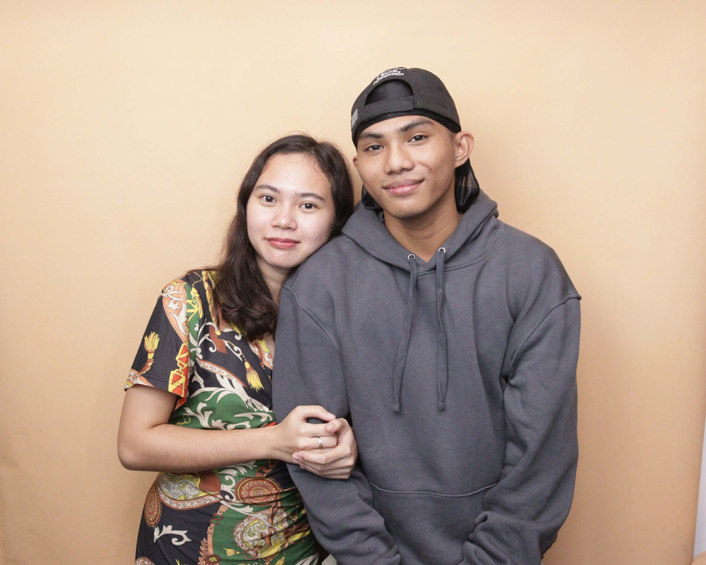

  
  <!-- ANIMATED HEADER -->
  
  
  

    
    
    
    
    
  

  
  <h3>✨ two students, two portfolios, one blog ✨</h3>
  
   
  
  <!-- LIVE PREVIEW BUTTON -->
  
  
    
  
  <!-- HERO IMAGE -->
  
  

---

## 🌊 **ABOUT THE PROJECT**

> *A simple, modern, and sleek portfolio blog website built as a duo project for Web Development class.*

Two students documenting their daily lives, coding journey, and everything in between — all wrapped in a **calming baby blue aesthetic** that's easy on the eyes.

 

## ✨ **FEATURES**

<table>
  <tr>
    <td width="50%" align="center">
       
      
       
      <h3>👥 TWO PORTFOLIOS</h3>
      
Separate sections for Elaine and CJ with individual about pages and blogs

       
    </td>
    <td width="50%" align="center">
       
      
       
      <h3>📝 DAILY BLOG</h3>
      
Fresh posts every day documenting our journey through college and life

       
    </td>
  </tr>
  <tr>
    <td width="50%" align="center">
       
      
       
      <h3>📱 FULLY RESPONSIVE</h3>
      
Looks great on desktop, tablet, and mobile devices

       
    </td>
    <td width="50%" align="center">
       
      
       
      <h3>🎨 BABY BLUE THEME</h3>
      
Clean, modern, and easy on the eyes — designed with love

       
    </td>
  </tr>
</table>

 

## 🎨 **COLOR PALETTE**

  
  | Color | Hex | Usage |
  |-------|-----|-------|
  |  Baby Blue | `#89c4f4` | Buttons, accents, hover states |
  |  Baby Blue Dark | `#5f9ea0` | Secondary accents |
  |  Baby Blue Light | `#b8d9f5` | Borders, dividers |
  |  Baby Blue BG | `#e6f0fa` | Background gradient |
  |  Text Dark | `#2c3e50` | Main text |
  |  White | `#ffffff` | Cards, contrast |

 

## 🚀 **AUTO-UPDATING FEATURES**

  
  | Feature | Description |
  |---------|-------------|
  | 🔄 **BLOG COUNTER** | Automatically counts all blog posts |
  | 📸 **GALLERY** | Auto-detects images in `/images/gallery/` |
  | 📚 **BLOG ARCHIVE** | Scans up to 9999 days of posts |
  | 🎂 **BIRTHDAY COUNTER** | Calculates days until next birthday |
  | 📝 **RECENT POSTS** | Dynamically loads latest 3 posts |

 

## 💻 **TECH STACK**

  

- **HTML5** — Structure
- **CSS3** — Styling with variables
- **JavaScript** — Dynamic features
- **Git & GitHub** — Version control
- **Google Fonts** — Poppins typography
- **Font Awesome** — Icons

 

## 👥 **THE TEAM**

  <table>
    <tr>
      <td align="center">
        
         
        <h3>Elaine L. Paras</h3>
        
<code>@doflsrn</code>

        

          
        

        
🎨 Art · 📖 Reading · 🏐 Volleyball

      </td>
      <td align="center">
        
         
        <h3>Charles James G. Mape</h3>
        
<code>@morteius</code>

        

          
        

        
💻 Coding · 🎮 Gaming · 🎸 Guitar

      </td>
    </tr>
  </table>

 

## 📊 **STATS**

  
  
  
  
  

 

## 💙 **ACKNOWLEDGMENTS**

- **Our Professor** — For the project guidance and support
- **Legazpi Art Pop Market** — For the inspiration
- **Baby Blue** — For being the perfect calming color
- **Coffee** — For keeping us awake during coding sessions

 

---

  

